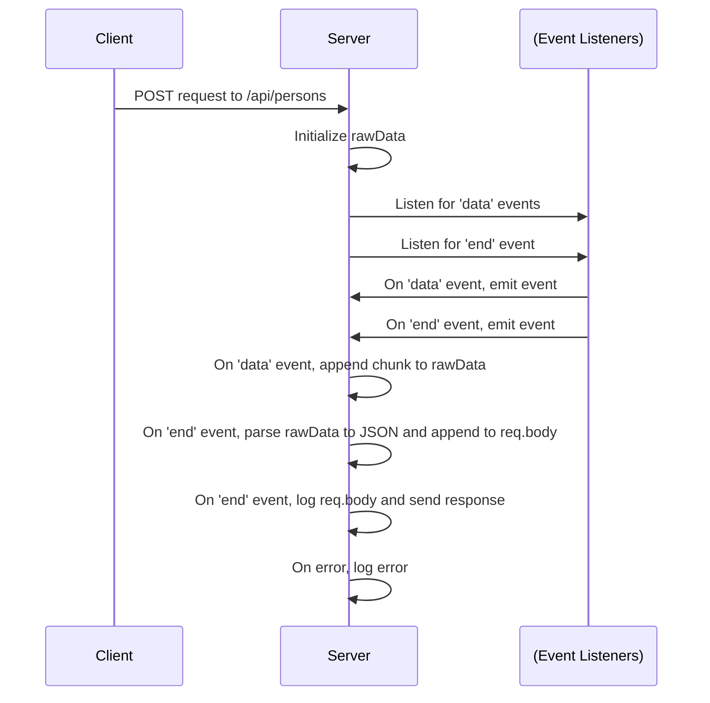

Given an ExpressJS application with a POST route:

```javascript
const express = require('express')
const app = express()

app.use(express.json())

app.post('/api/notes', (req, resp) => {
  const note = req.body
  console.log(note)
  resp.json(note)
})
```
{: .nolineno }

and a POST request:

```http
POST http://localhost:3001/api/persons HTTP/1.1
content-type: application/json

{
    "name": "Added Person",
    "number": "4444-4444"
}
```
{: .nolineno }

<br>
What happens when we don't use `app.use(express.json())`?

Why is it not needed for GET and DELETE requests?

Where is the request data?


<br>
The context I started with when I had these questions:
- I'm going through the Fullstackopen course and still coming to terms with the incantations needed to get a server application running. 
- The example comes from this [juncture](https://fullstackopen.com/en/part3/node_js_and_express#receiving-data).
- I had setup GET and DELETE routes just fine without the need for `app.use(express.json())`

---

## What happens when we don't use express.json()?

To better understand this function it helps to see what happens when you don't use it. After you comment that line out and you console log `req.body` you would find that it is `undefined`. This is because by default the request object does not contain a `body` property. This property is added by the `express.json()` middleware function when it parses the raw data and attaches it to the request object. This is what the [documentation](https://ExpressJS.com/en/4x/api.html#req.body) for ExpressJS says about `req.body`: "Contains key-value pairs of data submitted in the request body. By default, it is undefined, and is populated when you use body-parsing middleware such as `express.json()` or `express.urlencoded()`."

## So why is it needed for POST requests and not for GET and DELETE requests?

GET and DELETE send data as url parameters or as query strings so they can be accessed directly in the request object using `req.params` or `req.query`. Whereas POST, PUT and PATCH send raw data in the stream of the request object.

But where is this raw data in the request object? If you use `console.dir(req, {depth: null})` to unnest all the properties of the request object into 2700+ lines you would not find it.

## So where is the request data?

To find out where the request data is we will have to emulate in very simple terms what `express.json()` does:

```javascript
app.post("/api/persons", (req, res) => {
  console.dir(req.body);
  let rawData = "";

  req.on("data", chunk => {
    rawData += chunk;
  });

  req.on("end", () => {
    try {
      req.body = JSON.parse(rawData);
      console.log(req.body);
      res.send("Received the request");
    } catch (err) {
      console.log(err);
    }
  });
});
```
{: .nolineno }

First we run `console.dir(req.body)` so we can see that there is no object there and that it is currently `undefined`.
Then we initialize `rawData` so that the data chunks will be dumped in there. 

The `req` object here is created by ExpressJS and is an [enhanced](https://ExpressJS.com/en/api.html#req) version of NodeJS's [EventEmitter](https://nodejs.org/api/events.html#class-eventemitter) class and comes with a set of methods which you can use to bind functions to events, [`eventEmitter.on()`](https://nodejs.org/docs/latest/api/events.html#emitteroneventname-listener) is one of those methods. An alias for this method is [`eventEmitter.addListener()`](https://nodejs.org/api/events.html#emitteraddlistenereventname-listener) so that can give you a clue as to what it does. It can be set to listen for specific events on the request object and in this case the parameter [`"data"`](https://nodejs.org/api/stream.html#event-data) is set so it listens out for the `data` event that is emitted whenever a chunk of data is available to be read from the request body. 
The event handler function that comes after that is the logic that will be executed when it detects each `data` event. In this case each chunk of data that is read will be added on to `rawData`.

`req.on()` with an [`"end"`](https://nodejs.org/api/stream.html#event-end) parameter is then used to listen to the `end` event that is emitted when all data has been read from the request data stream. 
The event handler function then processes the data by attaching it to the `req.body` property of the request object.

You can then see in the console that that the JSON request data is now in `req.body` hence performing the essential functions of what the `express.json()` middleware does.

Here is a diagram which I hope can help to summarize everything:



---
